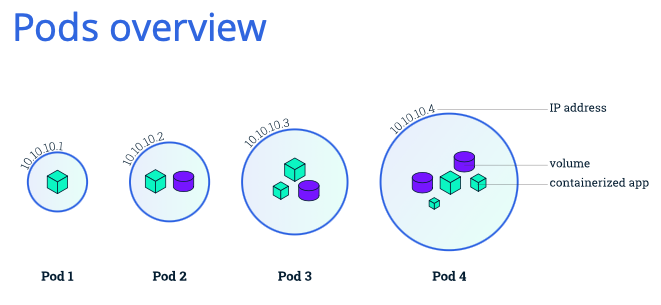
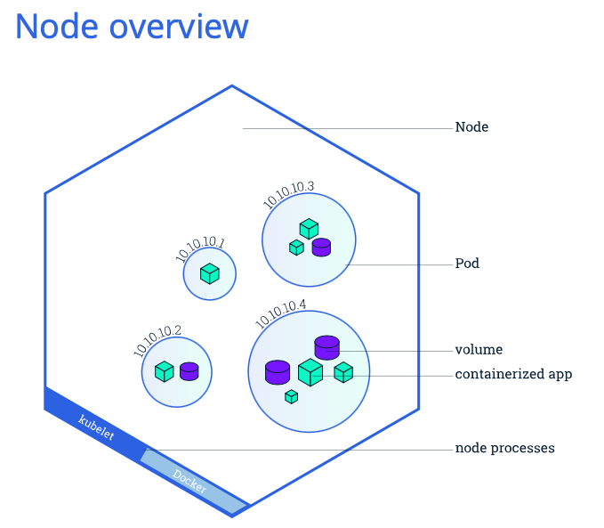
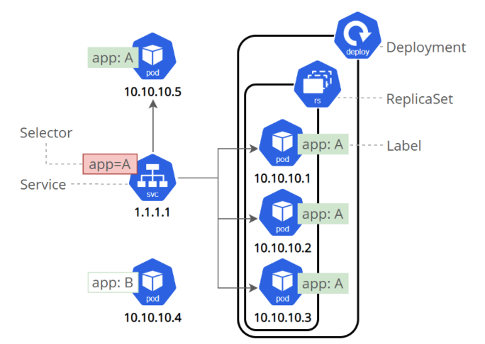

# TIL

## 오늘 공부한 컨셉

쿠버네티스 기초 https://kubernetes.io/docs/tutorials/kubernetes-basics/

## 상세내용

위 튜토리얼을 통해 배울 수 있는 것

+ 컨테이너된 애플리케이션 클러스터에 배포
+ 배포 확장
+ 컨테이너된 애플리케이션 소프트웨어 버전 업데이트
+ 컨터이너된 애플리케이션 디버깅

쿠버네티스를 통해 컨테이너화된 애플리케이션을 원할 때 동작시킬 수 있고 리소스 관리와 작업하는데 필요한 도구를 지원해줌. 


## Minikube로 클러스터 생성해보기

### 목표

+ 쿠버네티스 클러스터가 뭔지 알아보기
+ 미니쿠베가 뭔지 알아보기

쿠버네티스는 single unit으로 작동하도록 연결된 고가용성 컴퓨터 클러스터를 조정한다.

쿠버네티스의 추상화를 사용하면 컨테이너형 애플리케이션을 개별 시스템에 연결하지 않고 클러스터에 배포할 수 있음. 컨테이너형 애플리케이션은 과거의 배포 모델보다 유연하다. (옛날에는 호스트에 통합된 패키지로 직접 설치했음)

**쿠버네티스는 클러스터 전체에 걸쳐 애플리케이션 컨테이너의 배포 및 스케쥴링을 효율적으로 자동화함.**

쿠버네티스 클러스터를 구성하는 2가지 리소스

+ control plane이 클러스터를 조정함
  + scheduling applications
  + maintaining applications' desired state
  +  scaling applications
  + rolling out new updates 
+ node는 애플리케이션을 실행하는 worker임
  + 쿠버네티스 클러스터에서 worker로 일하는 VM이나 physical computer임
  + 각 노드는 Kubelet이 있고 노드를 관리하고 Kubelet은 control plane과 소통하기 위한 것
  + **쿠버네티스 클러스터는 production traffic을 처리하기 위해 최소 3개의 노드가 있어야함**

쿠버네티스로 배포하면 control plane이 애플리케이션 컨테이너를 실행하고 cluster node에서 작동하도록 스케줄링함. **node는 쿠버네티스 API를 써서 control plane과 통신** end user도 API써서 클러스터에 상호작용할 수 있음

Minikube는 경량 쿠버네티스로 VM임. 노드가 하나밖에 없음.

> minikube start


## kubectl로 생성하고 배포하기

애플리케이션 인스턴스가 생성되면 쿠버네티스 Deployment Controller는 지속적으로 인스턴스를 모니터링한다.

노드가 호스팅하고 있는 인스턴스가 삭제되거나 죽으면 Deployment Controller가 새로운 노드로 갈아끼운다.

deploy할 이름과 앱 이미지 location을 설정

> kubectl create deployment kubernetes-bootcamp --image=gcr.io/google-samples/kubernetes-bootcamp:v1

+ kubernets-bootcamp : 앱 이름
+ --image=gcr.io/google-samples/kubernetes-bootcamp:v1 : 이미지


제대로 굴러가는지 확인

> kubectl get deployments


Pods: Pods that are running inside Kubernetes are running on a private, isolated network. By default they are visible from other pods and services within the same kubernetes cluster, but not outside that network.


## Pod과 Node 보기

### Pod

쿠버네티스에서 가장 기본적인 배포 단위로 본다. 컨테이너를 개별적으로 배포하는 것이 아니라 Pod 단위로 배포하고 하나 이상의 컨테이너를 포함한다.

Pod은 하나 이상의 도커와 같은 애플리케이션 컨테이너와 해당 컨테이너에 대한 일부 공유 리소스의 그룹을 나타내는 쿠버네티스의 추상화이며 아래 리소스를 포함하고 있다.

+ shared storage, as Volumes -> pod 안에서 컨테이너끼리 저장소를 공유 가능
+ 고유 클러스터 IP 주소와 같은 네트워킹 -> 컨테이너끼리 ip주소 공유 가능
+ 컨테이너 이미지 버전 또는 사용할 특정 포트와 같은 각 컨테이너를 실행하는 방법에 대한 정보

각각의 Pod은 Node가 스케줄될 때 Node에 묶이게 되고 Node가 종료되거나 삭제될때 까지 남아있다. 노드가 고장나면 (쿠버네티스는 노드를 재실행하는데) 고장난 노드의 Pod은 다른 노드에서 클러스터되어 사용할 수 있다. 



(사진-https://kubernetes.io/docs/tutorials/kubernetes-basics/explore/explore-intro/)


### Node

worker machine으로 클러스터에 따라 가상 또는 물리적 machine이다.

각 노드는 Master에 의해 관리되며 한 노드에서 여러개의 Pod을 가질 수 있고 쿠버네티스 마스터는 자동적으로 node안에 있는 pod들을 스케줄링 한다. 

모든 쿠버네티스 노드는 최소한 다음과 같이 실행됨

+ kubelet은 쿠버네티스 Master와 Node간의 통신을 담당하는 프로세스로 Pod와 실행중인 컨테이너를 관리한다.
+ 컨테이너 런타임은 레지스트리에서 컨테이너 이미지를 가져와 묶여 있는 것을 풀고 애플리케이션을 동작시키는 책임을 맡음



## 

Pod 보기

> kubectl get pods

Pod 상세내용

> kubectl describe pods

Pod 실행

> kubectl exec $POD_NAME env

Pod bash 접속

> kubectl exec -ti $POD_NAME bash


## 서비스 사용하여 앱 노출시키기

쿠버네티스 클러스터안에 컨트롤러를 이용해서 포드를 띄웠다면 이제 그 포드들에 접근하는 방법에 대해 알아봐야할 때입니다. **포드는 컨트롤러에 의해 관리되기 때문에 한군데에 고정되서 떠 있지 않고, 클러스터내를 옮겨다니게 됩니다.** 이 과정에서 **노드를 옮기면서 실행되기도 하고 클러스터내의 포드 IP가 변경되기도 합니다.** 이렇게 동적으로 변하는 포드들에 고정된 방법으로 접근하기 위해서 사용하게는 쿠버네티스의 서비스(service)입니다. 

> https://www.oss.kr/info_techtip/show/35267293-bb21-45d1-b037-ece5d6d1bf8c

각 pod는 고유의 IP 주소가 있지만 서비스 없이 클러스터 외부로 노출될 수 없다. 서비스는 애플리케이션이 트래픽을 받을 수 있는 역할을 해준다. 

서비스 종류

+ ClusterIP(default) : 클러스터 내부에서 사용한 internal IP. 클러스터 내부의 노드나 포드에서 이 clusterIP를 이용하여 서비스에 연결된 포드에 접속가능
+ NodePort: 노드의 지정된 포트를 할당하는 방식. 클러스터 외부에서 접근가능. 가장 편한 방법. 포드가 node1에 없고 node2에만 있을때 node1:8080 으로 접속하면 node2로 연결해줌
+ LoadBalancer: AWS, GCP 같이 클라우드 서비스 사용할 때 사용가능. 포드랑 로드밸런서를 연결하여 로드밸런서의 IP로 외부에서 접근.
+ ExternalName: 클러스터 내부에서 외부로 접근할 때 쓰임. 설정해둔 CNAME값으로 연결되어 클러스터 외부로 접근할 수 있음. 프록시가 사용되지 않음.


### 서비스와 레이블

서비스는 포드간에 트래픽을 라우팅한다. 서비스는 애플리케이션에 영향을 주지 않으면서 포드가 죽고 쿠버네티스에서 복제될 수 있게 해주는 추상화다. 

서비스는 label과 selector를 사용하여 포드를 match하고 

레이블: key/value 페어이며 아래 방법으로 사용함

+ 개발, 테스트, production을 위한 객체 지정
+ version tag 내장시키기
+ 태그를 이용하여 객체 분류



위 그림에서 svc(service)를 통해 클러스터 안의 pod에 접근한다.

 ReplicaSet은 복제본 pod 집합을 안정적으로 유지하는데 쓰인다. 동일한 수의 pod의 가용성을 보장할 떄 쓰임

+ 정해진 수의 파드가 항상 안정적으로 실행되도록 관리합니다

+ 파드에 장애가 발생하거나, 사용할 수 없게 되는경우 파드를 재생성 합니다

+ 파드가 정해진 개수보다 많아질 경우 종료합니다

> pod는 장애 발생 또는 삭제되었을 때 자동구로 복구되지 않음. 관리자가 직접 확인하고 재생성해줘야하는데 그게 비효율적. 죽은 포드가 있으면 다시 살려줘야하는 것을 ReplicaSet이 해줌. 

레이블은 객체가 생성될 때나 나중에 붙일 수 있음. 언제든 수정가능.


서비스 목록 갖고오기

> kubectl get services

Nodeport로 노출시키기

> kubectl expose deloplyment/{pod 이름} --type="NodePort" --port 8080

외부에서 접근

> curl 쿠버네티스IP:node_port

레이블 붙이기

> kubectl label pod $POD_NAME app=v1

레이블 붙인 포드 확인하기

> kubectl get pods -l app=v1

서비스 삭제

> kubectl delete service -l run=포드이름

서비스가 삭제되어도 외부에서 접근이 막힌거지 내부에서 접근은 충분히 가능하다.

> ```
> kubectl exec -ti $POD_NAME curl localhost:8080 
> ```


## 여러 인스턴스 구동하기

스케일링은 복제본 수를 변경하여 확장한다.

쿠버네티스는 pod의 오토스케일링을 지원한다.

복제된 포드보기

> kubectl get rs

**ReplicaSet 이름은 항상 [DEPLOYMENT_NAME]-[RANDOM-STRNG] 포멧을 가진다**

위 커멘드에서 2가지 중요한 항목이 있다.

+ DESIRED : 배포를 생성할 때 정의하는 원하는 목표 애플리케이션 복제본 수
+ CUNRRENT : 현재 작동하는 복제본 수

복제본 늘리기

> kubectl sacle deployments/{deployment name} --replicas=4

위 커멘드는 4개로 복제함

> kubectl get pods -o wide로 확인해보면 pod의 IP 주소가 다 다름

복제본 줄이기

아까는 4개였는데 지금은 2개로 줄임

> kubectl sacle deployments/{deployment name} --replicas=2


## rolling update 수행

rolling update는 서버 다운 없이 업데이트하여 배포하는 것을 의미

여러 노드에 있는 포드들을 하나씩 업데이트 된 걸로 배포하면서 교체해나감

동작방식

+ 컨테이너 이미지 업데이트를 통해 애플리케이션을 현재 환경에서 다른 환경으로 업글
+ 이전 버전으로 롤백
+ 다운없이 애플리케이션을 지속적으로 통합하고 배포 

set image로 애플리케이션 업데이트

> kubectl set image deployments/kubernetes-bootcamp kubernetes-bootcamp=jocatalin/kubernetes-bootcamp:v2


나머진 여기를 참조 https://bcho.tistory.com/1266

