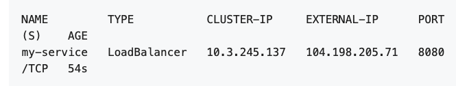
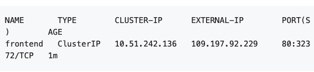
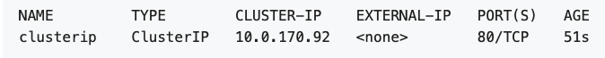

# TIL

## 오늘 공부한 컨셉

+ ConfigMaps와 Secrets -> 쿠버네티스 설정 파일들
  + secret은 base64로 인코딩되고 비밀번호, Oauth 토큰,ssh 키 같은 민감한 정보를 저장하고 관리
+ yaml 파일 배포하고 expose해서 외부에 접근하는 것 해봄.
  + yaml은 도커의 Dockerfile 같은 것
+ StatefulSet은 Pod의 상태를 관리하는 객체 
  + 순서대로 관리하는 특징이 있고 분산시스템에선 순서대로 처리할 필요없어서 따로 처리해줘야함
+ AppArmor는 리눅스에서 제공하는 보안기능인데, 쿠버네티스 PSP로 지원함. 
  + 적용 방법에 대해선 그때가서 공부
+ 외부에서 오는 source IP가 각 쿠버네티스 서비스 타입에 따라 어떤일이 일어나는지 공부했는데 잘 정리가 안되었음. 나중에 복습필요.

## 상세내용

## ConfigMaps and Secrets

ConfigMap과 Secret 사용으로 여러 컨테이너에서 서로 다른 환경변수에 할당 등 재사용할 수 있다. 

ConfigMaps는 key-value로 저장하는 API 객체다.

Secret도 key-value로 저장되지만 기밀/민감한 곳에 쓰이므로 base64 인코딩하여 저장되는 점에서 ConfigMap과 다르다.


쿠버네티스 config 파일 배포

> kubectl apply -f kubernetes.yaml

마이크로서비스 준비 됐는지 확인하기 **condition met**이라는 메시지가 뜨면 request 받을 준비가 된 것이다.

> kubectl wait --for=condition=ready pod -l app=inventory

ConfigMap 이름 설정해서 생성

> kubectl create configmap sys-app-name --from-literal name=my-system

+ sys-app-name : 클러스터에 배포할 ConfigMap name
+ name=my-system : key값은 name. value값은 my-system
+ --from-literal : key-value값을 ConfigMap에 설정해줌
+ --from-file이나 --from-env-file 등 다른 파라미터 사용가능

Secret 생성(이름은 generic)

> kubectl create secret generic sys-app-credentials --from-literal username=bob --from-literal password=bobpwd

ConfigMap과 Secret을 수정하려면 ``kubernetes.yaml``을 수정하면 된다. 

수정된 yaml 파일 적용

> kubectl replace --force -f kubernetes.yaml


쿠버네티스 연습할 수 있는 곳

> https://www.katacoda.com/courses/kubernetes/playground


## IP 5개만들고 외부에서 클러스터 접근하기(load-balancer)

https://kubernetes.io/docs/tutorials/stateless-application/expose-external-ip-address/

```yaml
apiVersion: apps/v1
kind: Deployment
metadata:
  labels:
    app.kubernetes.io/name: load-balancer-example
  name: hello-world
spec:
  replicas: 5
  selector:
    matchLabels:
      app.kubernetes.io/name: load-balancer-example
  template:
    metadata:
      labels:
        app.kubernetes.io/name: load-balancer-example
    spec:
      containers:
      - image: gcr.io/google-samples/node-hello:1.0
        name: hello-world
        ports:
        - containerPort: 8080
```

위 파일 ``load-balancer-example.yaml``을 생성하고 

> kubectl apply -f ./load-balancer-example.yaml

5개의 pod이 잘 생성됐는지 확인해보자.

> ```shell
> kubectl get deployments hello-world
> kubectl describe deployments hello-world
> ```

replicaSet도 확인하자

```shell
kubectl get replicasets
kubectl describe replicasets
```

LoadBalancer 타입으로 ``hello-world deployment``를 ``my-service``로 노출시키자

```shell
kubectl expose deployment hello-world --type=LoadBalancer --name=my-service
```

서비스 상태 확인

```shell
kubectl get services my-service
```



EXTERNAL-IP : 외부에서 접근할 수 있는 IP

curl로 외부에서 접근하려면 아래 명령어로 접근

> curl http://<external-ip>:<port>

여기서는

> curl http://104.198.205.71:8080

잘 썼으면 지우기도 잘 지워야한다. 외부에서 접근할 수 없도록 서비스를 지워주고 내부 deployment도 지워주자

```shell
kubectl delete services my-service
```

```shell
kubectl delete deployment hello-world
```


## PHP MongoDB 배포해보기

### Objectives

+ 몽고디비 시작하고
+ guestbook 프론트엔드 돌리고
+ 프론트엔드 서비스 노출시키고
+ 정리하기


mongo-deployment.yaml 파일 작성

```yaml
apiVersion: apps/v1
kind: Deployment
metadata:
  name: mongo
  labels:
    app.kubernetes.io/name: mongo
    app.kubernetes.io/component: backend
spec:
  selector:
    matchLabels:
      app.kubernetes.io/name: mongo
      app.kubernetes.io/component: backend
  replicas: 1
  template:
    metadata:
      labels:
        app.kubernetes.io/name: mongo
        app.kubernetes.io/component: backend
    spec:
      containers:
      - name: mongo
        image: mongo:4.2
        args:
          - --bind_ip
          - 0.0.0.0
        resources:
          requests:
            cpu: 100m
            memory: 100Mi
        ports:
        - containerPort: 27017
```


생성

```shell
kubectl apply -f https://k8s.io/examples/application/guestbook/mongo-deployment.yaml
```


mongo-service.yaml

```yaml
apiVersion: v1
kind: Service
metadata:
  name: mongo
  labels:
    app.kubernetes.io/name: mongo
    app.kubernetes.io/component: backend
spec:
  ports:
  - port: 27017
    targetPort: 27017
  selector:
    app.kubernetes.io/name: mongo
    app.kubernetes.io/component: backend
```

굴려주고

```shell
kubectl apply -f https://k8s.io/examples/application/guestbook/mongo-service.yaml
```


mongo-service랑 mongo-deployment 있는지 확인

```shell
kubectl get service
```


frontend-deployment.yaml

```yaml
apiVersion: apps/v1
kind: Deployment
metadata:
  name: frontend
  labels:
    app.kubernetes.io/name: guestbook
    app.kubernetes.io/component: frontend
spec:
  selector:
    matchLabels:
      app.kubernetes.io/name: guestbook
      app.kubernetes.io/component: frontend
  replicas: 3
  template:
    metadata:
      labels:
        app.kubernetes.io/name: guestbook
        app.kubernetes.io/component: frontend
    spec:
      containers:
      - name: guestbook
        image: paulczar/gb-frontend:v5
        # image: gcr.io/google-samples/gb-frontend:v4
        resources:
          requests:
            cpu: 100m
            memory: 100Mi
        env:
        - name: GET_HOSTS_FROM
          value: dns
        ports:
        - containerPort: 80
```

```shell
kubectl apply -f https://k8s.io/examples/application/guestbook/frontend-deployment.yaml
```


### 포트포워드

```shell
kubectl port-forward svc/frontend 8080:80
```

```shell
kubectl get service frontend
```



위 과정을 통해 몽고디비 셋팅하고 프론트까 끝 외부에서 EXTERNAL-IP로 접근하면 된다.

지울땐 deployment와 service 모두 지우자

```shell
kubectl delete deployment -l app.kubernetes.io/name=mongo
kubectl delete service -l app.kubernetes.io/name=mongo
kubectl delete deployment -l app.kubernetes.io/name=guestbook
kubectl delete service -l app.kubernetes.io/name=guestbook
```


## StatefulSet Basics

replicaSet, deployment는 모두 상태가 없는 포드들을 관리하는 용도였다.

https://kubernetes.io/docs/tutorials/stateful-application/basic-stateful-set/

StatefulSet는 상태가 있는 포드를 관리하는 용도이며 deployment와 scaling을 관리하고 애플리케이션의 상태를 저장하고 관리한다.

pod 생성되는 과정보기 -w -l 사용

> ```shell
> kubectl get pods -w -l app=nginx
> ```

StatefulSet의 포드는 고정적이고 고유한 ID가 있다. ID는 고유한 순서의 인덱스이며 이 인덱스는 StatefuleSet controller에 의해 Pod에 할당된다. 다음과 같은 형태로 포드의 이름을 갖는다.

>  <statefulset name>-<ordinal index>

StatefulSet 스케일링 업

```shell
kubectl scale sts web --replicas=5
```

``kubectl patch``로 스케일링 다운

```shell
kubectl patch sts web -p '{"spec":{"replicas":3}}'
```


StatefulSet 포드 Rolling Update 하기

```shell
kubectl patch statefulset web -p '{"spec":{"updateStrategy":{"type":"RollingUpdate"}}}'
```


StatefulSet ``--cascade=false``로 지우기

```shell
kubectl delete statefulset web --cascade=false
```


statefuleset이 상태를 가진 포드이고 이 포드들에게 rolling 작업을 해줄 때 순서가 보장되면서 진행된다.

하지만 분산 시스템에서는 순서 보장이 필요없다. 고유성과 ID만 있으면 충분한데 쿠버네티스 1.7부터 StatefulSet API 객체에 .spec.podManagementPolicy를 도입했다.

아래 yaml 파일에서 spec.podManagementPolicy 부분을 보면 Parallel로 되어있다. 저 부분을 통해 분산 시스템에서 순서 보장없이 롤링하거나 지울 수 있다.

```yaml
apiVersion: v1
kind: Service
metadata:
  name: nginx
  labels:
    app: nginx
spec:
  ports:
  - port: 80
    name: web
  clusterIP: None
  selector:
    app: nginx
---
apiVersion: apps/v1
kind: StatefulSet
metadata:
  name: web
spec:
  serviceName: "nginx"
  podManagementPolicy: "Parallel"
  replicas: 2
  selector:
    matchLabels:
      app: nginx
  template:
    metadata:
      labels:
        app: nginx
    spec:
      containers:
      - name: nginx
        image: k8s.gcr.io/nginx-slim:0.8
        ports:
        - containerPort: 80
          name: web
        volumeMounts:
        - name: www
          mountPath: /usr/share/nginx/html
  volumeClaimTemplates:
  - metadata:
      name: www
    spec:
      accessModes: [ "ReadWriteOnce" ]
      resources:
        requests:
          storage: 1Gi
```


## 보안에 관해서 

쿠버네티스는 현재 AppArmor 프로필을 node에 로드하기 위한 기본 메커니즘을 제공하지 않지만 프로필 설정에는 아래와 같은 방법이 있다.

+ 올바른 프로필이 로드되었는지 각 노드에서 포드를 실행하는 DaemonSet을 통해 설정
+ 노드가 초기화될 때 노드 스크립트 사용하거나 이미지 사용
+ ssh를 통해 각 노드에 프로필을 카피해서 적용


포드 보안은 PodSecurityPolicy라고 PSP라고한다. 이에 대해서는 https://bcho.tistory.com/1276 여기에서 구체적으로 공부하자.


## Service

여기서는 다양하게 애플리케이션을 외부로 노출시키는 법에 대해 알아본다.

용어정리

+ NAT
  + network address translation
+ [ Source NAT](https://en.wikipedia.org/wiki/Network_address_translation#SNAT)
  + replacing the source IP on a packet; in this page, that usually means replacing with the IP address of a node.
+ [Destination NAT](https://en.wikipedia.org/wiki/Network_address_translation#DNAT)
  + replacing the destination IP on a packet; in this page, that usually means replacing with the IP address of a [Pod](https://kubernetes.io/docs/concepts/workloads/pods/)
+ [VIP](https://kubernetes.io/docs/concepts/services-networking/service/#virtual-ips-and-service-proxies)
  + a virtual IP address, such as the one assigned to every [Service](https://kubernetes.io/docs/concepts/services-networking/service/) in Kubernetes
+ [kube-proxy](https://kubernetes.io/docs/concepts/services-networking/service/#virtual-ips-and-service-proxies)
  + a network daemon that orchestrates Service VIP management on every node


### Type=ClusterIP로 SourceIP 서비스

source-ip-app을 clusterip로 외부에 노출시키고 

```shell
kubectl expose deployment source-ip-app --name=clusterip --port=80 --target-port=8080
```

아래 명령어로 노출된 상태를 볼 수 있다.

```shell
kubectl get svc clusterip
```




nodeport일때랑 load-balancer일때도 있는데, 나중에 직접할 떄 다시보는게 낫겟다.

https://kubernetes.io/docs/tutorials/services/source-ip/